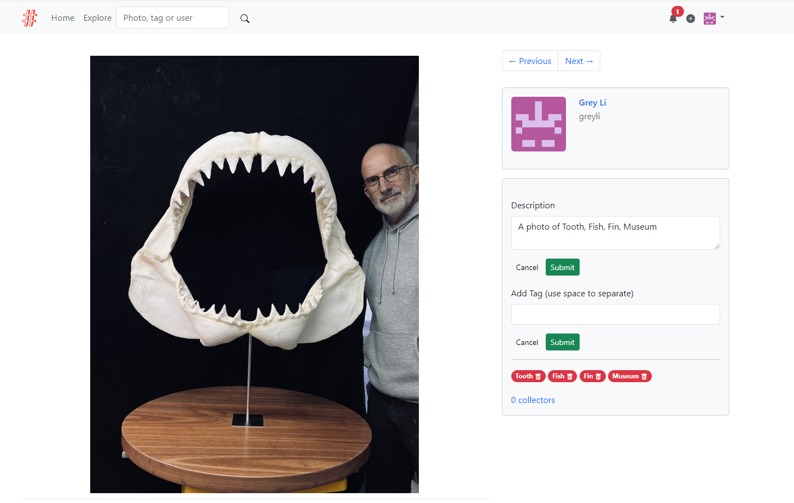

# Moments + ML — Alt-Text & Keyword Search

**Course:** COT 6930 — AI & ML in Production (Fall 2025)  
**Author:** Evan Parra  
**Final commit:** <REPLACE_WITH_FINAL_COMMIT_URL>

This fork adds two ML features to Moments using **Google Cloud Vision**:

1) **Automatic Alt-Text** when the uploader leaves the description blank.  
2) **Keyword Search** using auto-generated tags from Vision labels.

All code-level details live in the LaTeX report; this README is just how to run and verify.

---

## Live Demo (optional)
- Cloud Run URL: **<ADD_URL_IF_AVAILABLE>**

---

## Quick Start (PDM only)

This project uses **PDM** and a pinned lockfile. Do **not** use `pip install`.

### Clone
```
git clone https://github.com/DevDizzle/moments
cd moments
```

### Install
```
pdm install
```

### Configure environment (via `.env`)
Create a local `.env` (not committed) with:

```
GOOGLE_APPLICATION_CREDENTIALS=path/to/vision-key.json
FLASK_APP=moments
FLASK_ENV=development
UPLOAD_FOLDER=static/uploads
VISION_LABEL_SCORE_THRESHOLD=0.70
```

- The JSON key is **present locally** but **not committed**.
- `.env` is ignored by git.

### Initialize & run
```
pdm run flask init-app
pdm run flask lorem      # optional demo data
pdm run flask run        # http://127.0.0.1:5000
```

---

## Verify (Quick Path)

1) Upload an image **without** a description → check the gallery/detail HTML: the `` has a real `alt` attribute.  
2) Search a detected label (e.g., `/search?q=dog`) → matching photos appear.  
3) As the photo owner, remove a tag you don’t want → mitigation works.  
4) Confirm no secrets in git: `.gitignore` includes `.env` and key filename patterns.

---

## Evidence Image

For grading, I used this photo (man standing next to shark jaws). Commit it at repo root:

```
shark-jaws.png
```

It renders here:



---

## Documentation

- Full technical write-up (design, risks, production plan, and code snippets): **see LaTeX report** at `docs/report.pdf` (or your Overleaf export path).

---

## Repo Hygiene

- No credentials are committed.  
- `.gitignore` excludes `.env` and typical key filenames.  
- Any service account key is referenced via `GOOGLE_APPLICATION_CREDENTIALS` and kept outside version control.

---

## License

MIT (see `LICENSE`).
